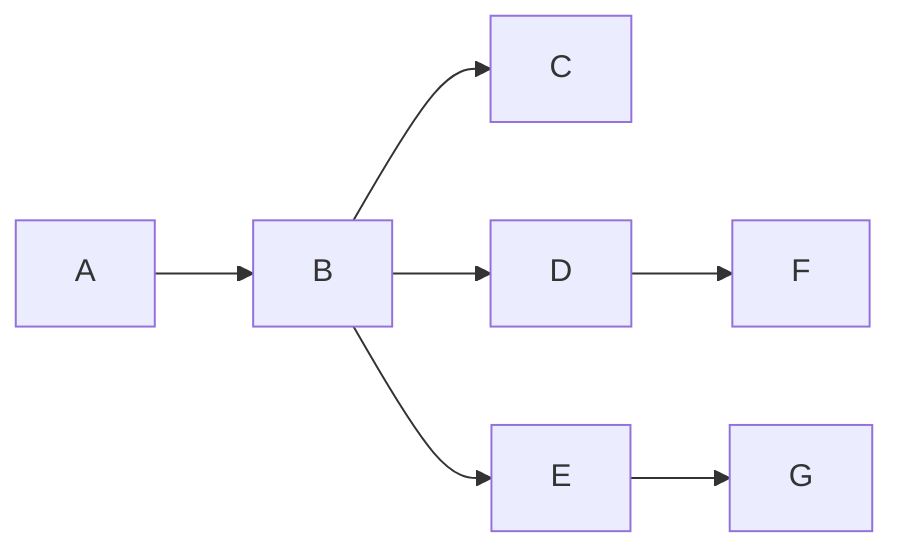

# Project 2 - TET Bookstore

This repository contains the code for the **Bookstore Monolithic application**, which is a simple bookstore application that allows users to view, add, update, and delete books. The application is built using **Flask** and uses a **MySQL** database to store book information.

We must deploy this application in different ways to complete three objectives:

1. **Objective 1**: Deploy on a single AWS Virtual Machine with domain, SSL, and NGINX.
2. **Objective 2**: Deploy with autoscaling and load balancing on AWS.
3. **Objective 3**: Refactor and deploy using a microservices architecture on AWS.

---

## Table of Contents

- [Project 2 - TET Bookstore](#project-2---tet-bookstore)
- [Objective 1: VM Deployment](#objective-1-vm-deployment)
  - [Completion Features](#completion-features-for-objective-1)
- [Objective 2: Autoscaling Deployment](#objective-2-autoscaling-deployment)
  - [Completion Features](#completion-features-for-objective-2)
- [Objective 3: Microservices Deployment](#objective-3-microservices-deployment)
  - [Completion Features](#objective-completion-features)

---

## Objective 1: VM Deployment

Deploy the **Bookstore Monolithic application** on a **Virtual Machine on AWS**, with its own **domain**, **SSL certificate**, and **reverse proxy using NGINX**.

### Completion Features for Objective 1

- ✅ **Completed**
- 🌐 **Domain**: [objective1.p2tet.duckdns.org](https://objective1.p2tet.duckdns.org) points to the Monolithic application.
- 🔐 **SSL Certificate**: Provided by Let's Encrypt and automatically renewed every 90 days.
- 🔁 **Reverse Proxy**: NGINX handles incoming requests and routes them to the application container.  
  - Domain: `p2tet.duckdns.org`
  - Subdomain for app: `objective1.p2tet.duckdns.org`
  - Reverse proxy terminates SSL and forwards requests to port 5000.
  - NGINX is hosted on a separate EC2 instance to support multiple objectives.

---

## Objective 2: Autoscaling Deployment

Cloud deployment of the monolithic application using **EC2 autoscaling**, **load balancing**, and a **highly available database**.

### Completion Features for Objective 2

- ✅ **Completed**
- 🔄 **Extension of Objective 1**: Builds upon the previous setup, adding new infrastructure.
- 🗃️ **Highly Available Database**: Implemented using **Amazon Aurora and RDS**, allowing distributed access.
- ⚖️ **Load Balancer**: Distributes traffic among multiple app instances connected to a remote DB.
- :scroll: **NFS:** A Network File System is used among the members of the auto-scaling group to share static content.
- 📈 **AWS Autoscaling**:
  - AMI-based scaling policy.
  - Minimum: 1 instance.
  - Maximum: 6 instances.
  - Desired capacity: 2 instances (scales based on demand).
- 🌐 **Domain**: [objective2.p2tet.duckdns.org](https://objective2.p2tet.duckdns.org) points to the Monolithic application with autoscaling.

## Objective 3
Re-engineer the BookStore Monolitica app, to be divided into 3 coordinating microservices:
- Microservice 1: Authentication: will manage register, login, logout.
- Microservice 2: Catalog: will allow to visualize the offer of books on the platform.
- Microservice 3: Purchase, Payment and Delivery of books sold on the platform.

### Objective Completion Features

- [x] Completed
- **Domain**: [objective3.p2tet.duckdns.org](https://objective3.p2tet.duckdns.org) is the domain which points to the Monolithic application with autoscaling.
- **Microservices**: we integrated the 3 microservices which were asked for in the objective.
- **Swarm**: we used Docker Swarm to deploy the application in a cluster of 3 nodes.
- **NFS**: we used NFS to share the favicon of the page between the 3 nodes and the objective 2.

## Architectural Diagram
- **A**: Browser
- **B**: Nginx Proxy Reverso
- **C**: App Monolítica Objetivo 1
- **D**: Load Balancer Objetivo 2
- **E**: Load Balancer Swarm (IP Nodo Master)
- **F**: Instancias Autoescaladas por AWS
- **G**: Contenedores en 3 Instancias AWS (incluye Master)

